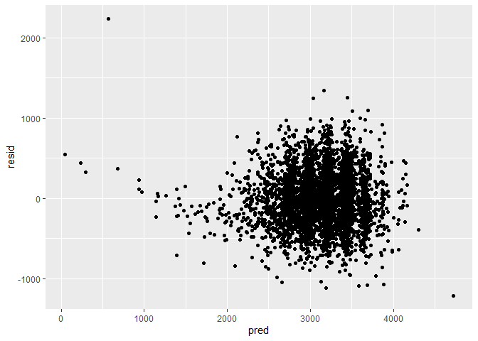
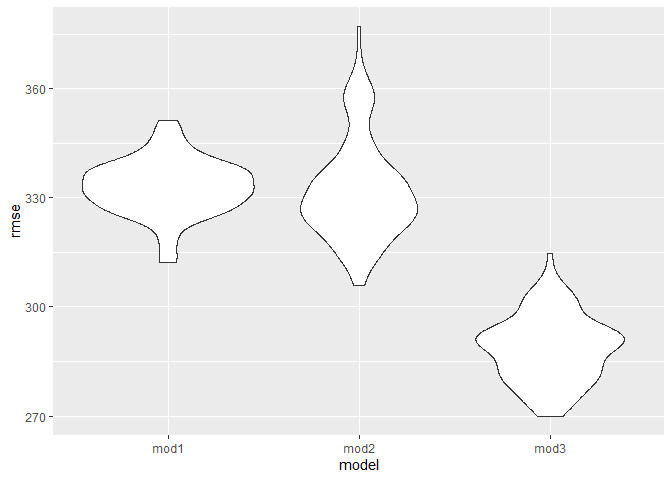
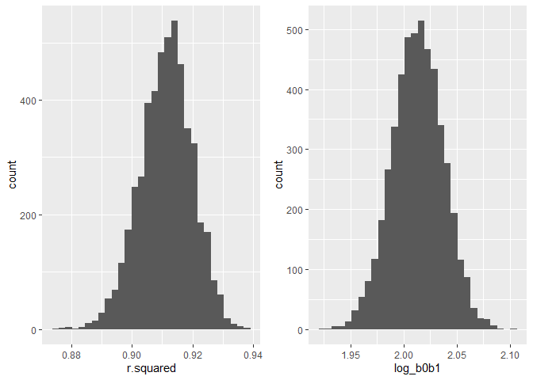

p8105\_hw6\_fw2334
================
Frances Williams
11/14/2019

# Problem 1

Importing and tidying data

``` r
birthweight_data = read_csv(file = "./files/birthweight.csv") %>% 
  mutate(
    babysex = factor(babysex, levels = c(1,2), labels = c("male", "female")),
    frace = factor(frace, levels = c(1,2,3,4,8,9), labels = c("white", "black", "asian", "puerto rican", "other", "unkown")),
    malform = factor(malform, levels = c(0,1), labels = c("absent", "present")),
    mrace = factor(mrace, levels = c(1,2,3,4,8), labels = c("white", "black", "asian", "puerto rican", "other"))
  )
```

#### Modeling

The following model is proposed based on factors clinically relevant to
predicting birthweight.

``` r
set.seed(1)

model1 = lm(bwt ~ gaweeks + babysex + bhead, data = birthweight_data)

bw_res_pred = birthweight_data %>% 
  modelr::add_residuals(model1) %>% 
  modelr::add_predictions(model1) 

bw_res_pred %>% 
  ggplot(aes(x = pred, y = resid)) + 
  geom_point()
```

<!-- -->

#### Other model comparisons and cross validation

``` r
cv_df = crossv_mc(data = birthweight_data, n = 100)

cv_df = 
  cv_df %>% 
  mutate(mod1 = map(train, ~lm(bwt ~ gaweeks + babysex + bhead, data = .x)),
         mod2 = map(train, ~lm(bwt ~ blength + gaweeks, data = .x)),
         mod3 = map(train, ~lm(bwt ~ bhead + blength + babysex + bhead*blength + bhead*babysex + blength*babysex + bhead*blength*babysex, data = as_tibble(.x)))) %>% 
  mutate(rmse_mod1 = map2_dbl(mod1, test, ~rmse(model = .x, data = .y)),
         rmse_mod2 = map2_dbl(mod2, test, ~rmse(model = .x, data = .y)),
         rmse_mod3 = map2_dbl(mod3, test, ~rmse(model = .x, data = .y)))

cv_df %>% 
  select(starts_with("rmse")) %>% 
  pivot_longer(
    everything(),
    names_to = "model", 
    values_to = "rmse",
    names_prefix = "rmse_") %>% 
  mutate(model = fct_inorder(model)) %>% 
  ggplot(aes(x = model, y = rmse)) + geom_violin()
```

<!-- -->

# Problem 2

#### Loading data

``` r
weather_df = 
  rnoaa::meteo_pull_monitors(
    c("USW00094728"),
    var = c("PRCP", "TMIN", "TMAX"), 
    date_min = "2017-01-01",
    date_max = "2017-12-31") %>%
  mutate(
    name = recode(id, USW00094728 = "CentralPark_NY"),
    tmin = tmin / 10,
    tmax = tmax / 10) %>%
  select(name, id, everything())
```

#### Bootstrapping

``` r
set.seed(1)

boot_sample = function(df) {
  sample_frac(df, replace = TRUE)
}

boot_straps = 
  tibble(
    strap_number = 1:5000,
    strap_sample = rerun(5000, boot_sample(weather_df))
  )


bootstrap_results = boot_straps %>% 
  mutate(
    models = map(strap_sample, ~ lm(tmax ~ tmin, data = .x)),
    results = map(models, broom::tidy)) %>%
  unnest(cols = c(results)) %>% 
  select(strap_number, term, estimate, models) %>% 
  pivot_wider(
    names_from = term,
    values_from = estimate) %>% 
  janitor::clean_names() %>% 
  rename(b0 = intercept, b1 = tmin) %>% 
  mutate(
    log_b0b1 = log(b0*b1),
    r2 = map(models, broom::glance)) %>%
  unnest(cols = c(r2))
```

#### Distributions

``` r
r2_dist = bootstrap_results %>% 
  ggplot(aes(x = r.squared)) +
  geom_histogram()

logb0b1_dist = bootstrap_results %>% 
  ggplot(aes(x = log_b0b1)) +
  geom_histogram()

r2_dist + logb0b1_dist
```

<!-- -->

Both distributions look normal, with the average r^2 value falling
around 0.91 and the average log(β0∗β1) falling around 2.03. The 95%
confidence interval for r^2 is (0.89, 0.93), and the 95% confidence
interval for the log(β0∗β1) is (1.96, 2.06).
